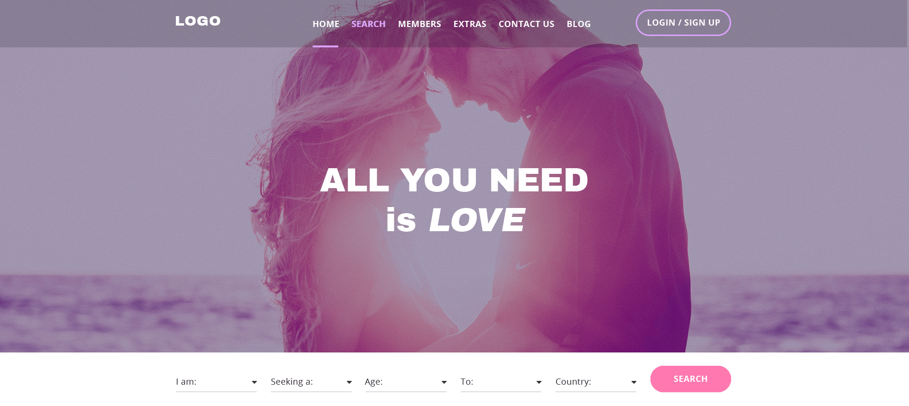
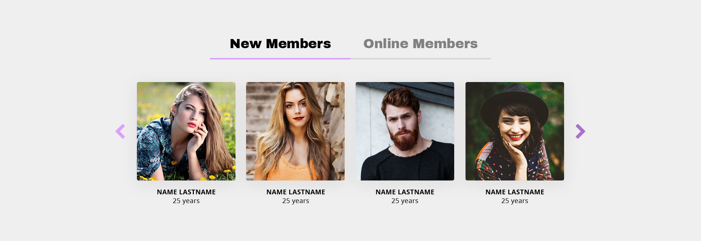
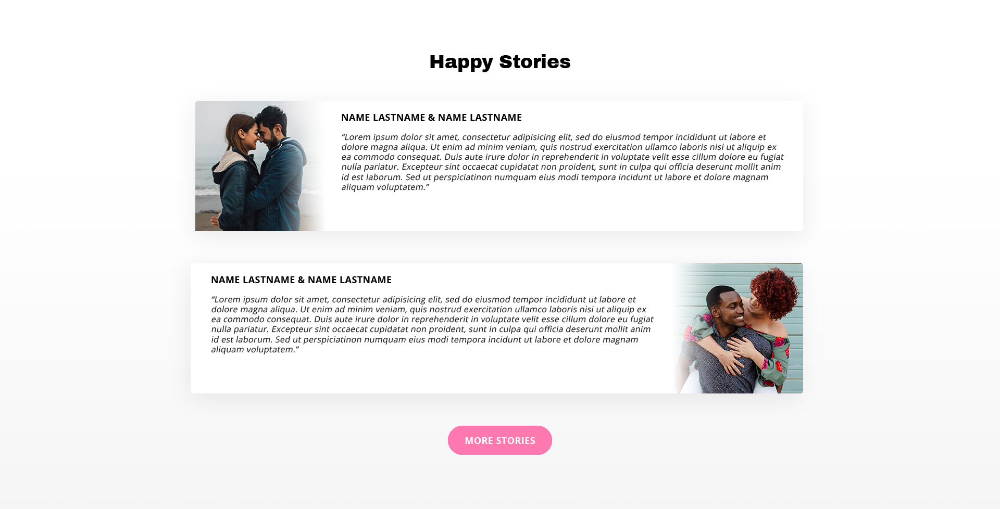
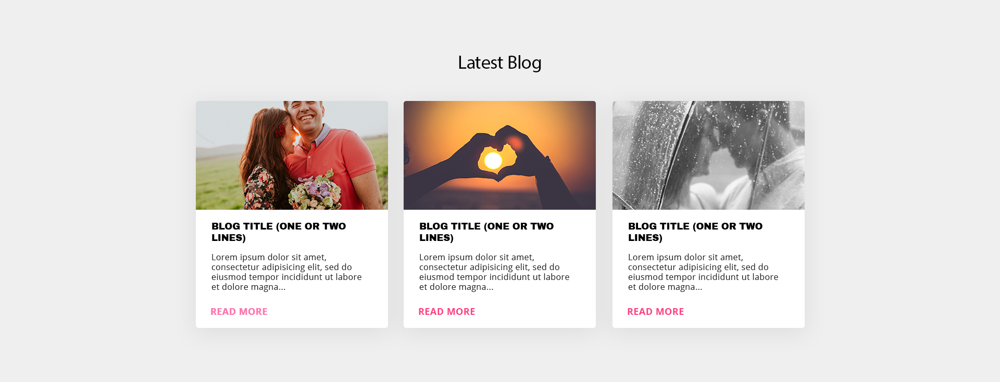
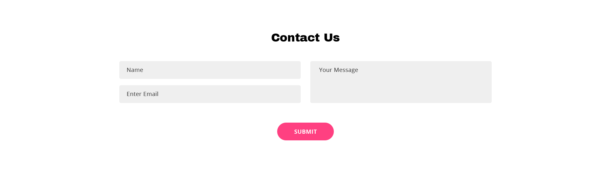

# Carma Dating Project

### Задача

* Создание сайта по предоставленному psd макету.

### Общие требования к сайту

* Корректное отображение сайта на следующих разрешениях экрана: 320px, 687px, 992px, 1200 px 
* Поддержка браузеров: последние версии Chrome, Firefox, Safarі, Opera, MS Edge. 
* Для реализации функционала сайта используйте ReactJS.

### Особенности страницы:

* Поиск по клиентской базе данных.
* Слайдеры новых пользователей и пользователей в сети.
* Блок "Happy Stories".
* Отображение последних постов в блоге.
* Контактная форма. 

## Лендинг 



1. Header
    * При нажатии на каждый элемент меню страница плавно прокручивается до соответствующего блока на странице. 
    * Для реализации плавной прокрутки страницы разрешается использовать сторонние ресурсы(например, https://github.com/fisshy/react-scroll).
    * Меню дожно быть зафиксировано в верхней части экрана, чтобы пользователь мог им всегда воспользоватся.
    * Нажатие на "Login / Sign up" открывает модальное окно как в дизайне:
        * При этом скролинг страницы должен блокироватся
2. Поиск по клиентской базе сайта:
    * Имитируя ответ бекенда произведите выборку из json-файла и вывидете результат выборки в консоль.
    * Опции выпадающих списков придумать самому

## Слайдеры новых пользователей и пользователей в сети



* Создайте 2 слайдера по 6 слайдов в каждом c произвольным контентом
    * Примечание все персоны должны находится в одном масиве, реализуйте фильтрацию по свойству isOnline, что бы наполнить соответствующий слайдер
* Смена слайдов должна присходить с интервалом в 3с. 
* По нажатию стелок навигации, автоматическая смена слайдов должна приостанавливатся, 
* пока пользователь листает слайды вручную. Если в течении 5с пользователь не нажимал на элементы навигации, должна возобновиться автоматическая смена слайдов. 
* При нажатии на имя персоны, открывается модальное окно с фото, именем, возрастом, и происвольным описанием данной персоны. Для реализации этого задания использйте маршрутиризацию.
* При нажатии на табы над сладйдерами, изменяются слайдеры
    * Примечание : при переключении табов состояние слайдеров должно быть сохранено, и при возвращении на прошлый таб, польователь может продолжить просмотр с того места на котором остановился.
 
 ## Информационная секция

 

 * У этого блока должен присутствовать еффект паралакса для фонового изображения.

 ## Блок "Happy Stories"
 
 

 * При нажатии на кнопку "More stories", панели с историями должены меняться на следущий набор историй(наборов историй должно быть 3, итого 6 историй)

 ## Блок "Latest Blog"



* Используя файл data.json, реализуйте следущую логику:
    * Одновременно на экране должно отображатся 3 поста
    * Через 5 сек посты сменяются следущими тремя:
        * Следущие 3 поста должны быть выбраны случайно по свойству ID
        * Следущий набор постов не должен содержать постов из предыдущего набора
    * При нажатии на имя поста открывается модальное окно в котором должна быть отображена полная информация
    * Пока открыто модальное окно смена постов приостанавливается.
    * Используйте маршрутиризацию для открытия модального окна поста.
    * Для анимации используйте аддон ReactCSSTransitionGroup. Установка аддона:

```
npm install react-addons-css-transition-group
```


## Блок "Join Us"


* При нажатии на кнопу "Create an Account", должно отрыватся модальное окно с активированым табом Sign Up


## Контактная форма



* Должна присутствовать валидация для полей контактной формы:
    * Name:
        * Цифры
        * Длина имени не больше 25 знаков
    * Email:
        * Валидация ввода значения что не соответствует патерну Email
    * Message: 
        * Длинна сообщение не больше 150 знаков
        * (Задание со звездочкой): при достижении длины 140 знаков в углу формы появляется сообщение с текущим количеством оставшихся символов, при достижении 145 знаков цвет сообщения меняется на крассный

## Контактная форма


* Ссылки должны плавно скролить к соответствующему блоку сайта.
* Социальные кнопки должны вести на главную страницу соответствующей социальной сети.
